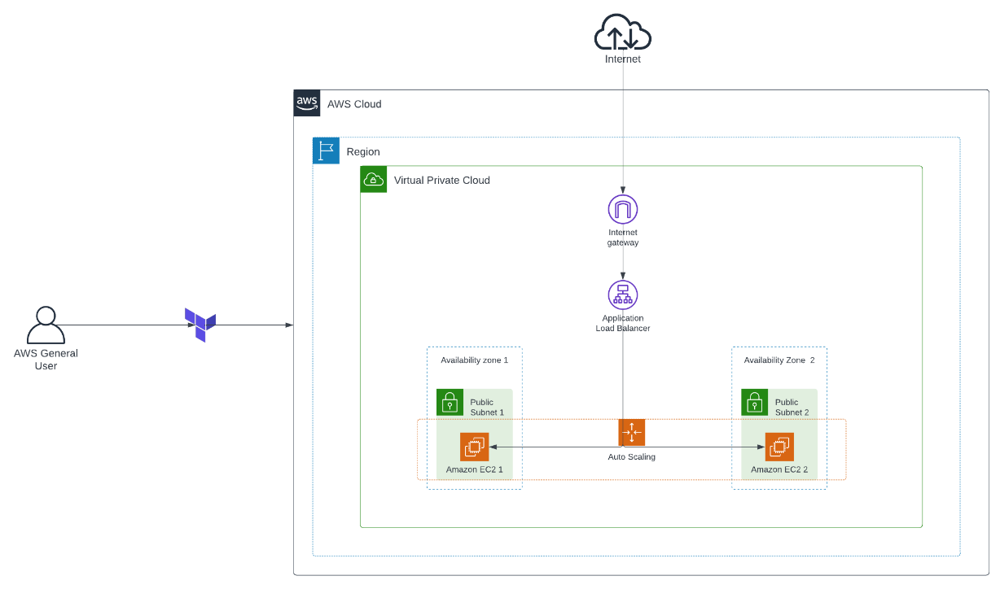

## High availavility deployment with Terraform

This project demonstrates the implementation of a high availability infrastructure in AWS using Auto Scaling Groups (ASG) and Elastic Load Balancers (ELB) with Terraform. It also includes the setup of VPC, subnets, Internet Gateway (IG), and route tables.

## Requirements

No requirements.

## Providers

| Name | Version |
|------|---------|
|  [aws](#provider\_aws) | 5.68.0 |

## Modules

No modules.

## Resources

| Name | Type |
|------|------|
| [aws_autoscaling_group.asg](https://registry.terraform.io/providers/hashicorp/aws/latest/docs/resources/autoscaling_group) | resource |
| [aws_internet_gateway.igw](https://registry.terraform.io/providers/hashicorp/aws/latest/docs/resources/internet_gateway) | resource |
| [aws_launch_template.ec2-template](https://registry.terraform.io/providers/hashicorp/aws/latest/docs/resources/launch_template) | resource |
| [aws_lb.alb](https://registry.terraform.io/providers/hashicorp/aws/latest/docs/resources/lb) | resource |
| [aws_lb_listener.alb-listener](https://registry.terraform.io/providers/hashicorp/aws/latest/docs/resources/lb_listener) | resource |
| [aws_lb_target_group.target-group](https://registry.terraform.io/providers/hashicorp/aws/latest/docs/resources/lb_target_group) | resource |
| [aws_route_table.public-route-table](https://registry.terraform.io/providers/hashicorp/aws/latest/docs/resources/route_table) | resource |
| [aws_route_table_association.prta-1](https://registry.terraform.io/providers/hashicorp/aws/latest/docs/resources/route_table_association) | resource |
| [aws_route_table_association.prta-2](https://registry.terraform.io/providers/hashicorp/aws/latest/docs/resources/route_table_association) | resource |
| [aws_security_group.alb_security_group](https://registry.terraform.io/providers/hashicorp/aws/latest/docs/resources/security_group) | resource |
| [aws_security_group.asg-sg](https://registry.terraform.io/providers/hashicorp/aws/latest/docs/resources/security_group) | resource |
| [aws_subnet.web-subnet1](https://registry.terraform.io/providers/hashicorp/aws/latest/docs/resources/subnet) | resource |
| [aws_subnet.web-subnet2](https://registry.terraform.io/providers/hashicorp/aws/latest/docs/resources/subnet) | resource |
| [aws_vpc.vpc](https://registry.terraform.io/providers/hashicorp/aws/latest/docs/resources/vpc) | resource |

## Inputs

| Name | Description | Type | Default | Required |
|------|-------------|------|---------|:--------:|
|  [ami-launch-template](#input\_ami-launch-template) | Value for EC2 AMI | `string` | n/a | yes |
|  [az-1](#input\_az-1) | Value for AZ 1 | `string` | n/a | yes |
|  [az-2](#input\_az-2) | Value for AZ 2 | `string` | n/a | yes |
|  [capacity](#input\_capacity) | Value for desired instances | `number` | n/a | yes |
|  [department](#input\_department) | Value for Department | `string` | n/a | yes |
|  [environment](#input\_environment) | Value for Environment | `string` | `"DEV"` | no |
|  [health-check-type](#input\_health-check-type) | Value for type of health check | `string` | n/a | yes |
|  [igw-name](#input\_igw-name) | Value for Internet GateWay | `string` | n/a | yes |
|  [instance-type](#input\_instance-type) | Value for instance type | `string` | n/a | yes |
|  [key-name](#input\_key-name) | Value for key name | `string` | n/a | yes |
|  [max-size](#input\_max-size) | Value for maximum instances runing | `number` | n/a | yes |
|  [min-size](#input\_min-size) | Value for minimum instances runing | `number` | n/a | yes |
|  [name-project](#input\_name-project) | Value for name of project | `string` | n/a | yes |
|  [owner](#input\_owner) | Value for Owner name | `string` | n/a | yes |
|  [project](#input\_project) | Value for Project number | `string` | n/a | yes |
|  [region](#input\_region) | Value for region on AWS | `string` | n/a | yes |
|  [vpc-cidr-block](#input\_vpc-cidr-block) | Value for CIDR of VPC | `any` | n/a | yes |
|  [vpc-name](#input\_vpc-name) | Value for name of VPC | `string` | n/a | yes |
|  [web-subnet1-cidr](#input\_web-subnet1-cidr) | Value dor web subnet-1 cidr | `string` | n/a | yes |
|  [web-subnet1-name](#input\_web-subnet1-name) | Value for web subnet1 name | `string` | n/a | yes |
|  [web-subnet2-cidr](#input\_web-subnet2-cidr) | Value dor web subnet-2 cidr | `string` | n/a | yes |
|  [web-subnet2-name](#input\_web-subnet2-name) | Value for web subnet2 name | `string` | n/a | yes |

## Outputs

| Name | Description |
|------|-------------|
|  [dns](#output\_dns) | value = aws_lb.alb.dns_name |
